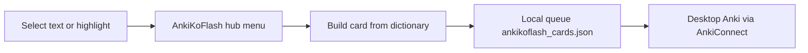
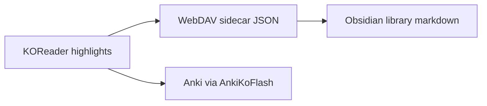

# AnkiKoFlash — short summary of the plugin and recent work

## What the plugin is

**AnkiKoFlash** ([`AnkiKoFlash.koplugin`](../), v1.1.1) is a KOReader plugin that turns reading highlights into Anki cards and sends them over Wi‑Fi via **AnkiConnect**.

**Reading flow:**

**Two card types:**

| Type | What it does |
|------|----------------|
| **Vocabulary Card** | KOReader dictionary lookup + offline etymology on the back |
| **Memorization Card** | LPCG-style step cards + full recitation for poetry/prose |

**Core Lua modules:**

- [`main.lua`](../main.lua) — plugin entry, highlight-menu hooks, card flows
- [`plugin_menu.lua`](../plugin_menu.lua) — AnkiKoFlash hub menu
- [`dictionary_lookup.lua`](../dictionary_lookup.lua) / [`etymology_lookup.lua`](../etymology_lookup.lua) — StarDict definition and offline etymology lookup
- [`anki_sync.lua`](../anki_sync.lua) — AnkiConnect HTTP
- [`card_storage.lua`](../card_storage.lua) / [`card_manager.lua`](../card_manager.lua) — pending queue, My Cards, batch send
- [`highlight_inbox.lua`](../highlight_inbox.lua) — all highlights in book, multi-select, batch send/delete
- [`settings_viewer.lua`](../settings_viewer.lua) — on-device settings (decks, note types)
- [`selectable_menu.lua`](../selectable_menu.lua) — reusable checklist UI (select all, delete selected)
- [`atomic_json.lua`](../atomic_json.lua) / [`card_sync.lua`](../card_sync.lua) — recoverable persistence and cloud queue merge
- [`anki_retry.lua`](../anki_retry.lua) — read-only transient retry policy and safe send verification support

**Highlight colors:** orange = pending in queue; green = sent to Anki. Tap green highlights for "see Recently sent," not the card viewer.

**Dev setup:** WSL emulator via [`dev-start.sh`](../dev-start.sh); test book `alice.epub`; syncs plugin into `~/koreader-dev/plugins/`.

---

## Companion: TagBankHighlightSync

Not part of AnkiKoFlash itself, but used alongside it in a typical setup ([`tagbankhighlightsync.koplugin`](https://github.com/3gnome/tagbankhighlightsync.koplugin) sibling repo):

- Tags highlights, syncs `*.sdr.json` to WebDAV, exports Obsidian library (`library/quotes/`, `tags/`, `books/`)
- When **both** plugins are installed, TagBank settings use Anki-branded labels for orange/green filters; alone, labels stay neutral (`plugin_peers.lua` in TagBank repo)

Obsidian export is **one-way** (KOReader → WebDAV → markdown). Delete-in-Obsidian with KOReader sync is not built yet.

---

## Recent session work

### AnkiKoFlash

1. **View All Highlights** — highlight menu and AnkiKoFlash hub; **Switch book…**, **Sync All Highlights** (Tag Bank), live annotation discovery, delete + batch Anki send. Files: [`highlight_inbox.lua`](../highlight_inbox.lua), [`highlight_books.lua`](../highlight_books.lua), [`plugin_peers.lua`](../plugin_peers.lua).

2. **Tag Bank companion docs** — [`docs/tag-bank-companion.md`](tag-bank-companion.md), [`docs/webdav-setup-windows.md`](webdav-setup-windows.md). Tag Bank repo: [tagbankhighlightsync.koplugin](https://github.com/3gnome/tagbankhighlightsync.koplugin).

3. **Alice reset tooling** — [`scripts/reset_alice.sh`](../scripts/reset_alice.sh) orchestrates PC-only clean slate: Anki notes, local card queue, epub/sidecars, WebDAV JSON, Obsidian library purge, regen, fresh epub download.

4. **Highlight cleanup** — [`highlight_cleanup.lua`](../highlight_cleanup.lua) removes orphan orange vocab/mem highlights after background Anki send (with spec).

5. **Production hardening** — atomic/recoverable cards, settings, and cloud writes; retry-safe queue migration and memorization-aware cloud identity; verified send reconciliation; bounded/cancellable batch work; transactional settings; privacy-safe operational logs.

6. **Memorization recovery** — sends are chunked at 50 notes, passages over the configurable 80-step default require confirmation without truncation, and partial sends remain pending until all notes are sent or verified.

7. **Document-safe cleanup** — PDF/table positions use structural comparison, and Recently Sent cleanup requires the exact source document so another book cannot lose a matching highlight.

8. **Dictionary-only rework** — removed all AI providers, API keys, prompts, and the Wiki Card flow; added offline **etymology** lookup plus the `Etymology` field on vocabulary cards; renamed the plugin to AnkiKoFlash with automatic migration of legacy `ankikooai_*` storage files.

### TagBankHighlightSync

4. **Screenshot capture fix (Windows Desktop)** — `highlight_capture.lua`: stopped comparing KOReader color userdata to `nil` with `==` (crashed on BBRGB32); fixed `blitFrom` arg order; plain-text capture path.

5. **Untagged Sync now** — library export for untagged highlights without requiring tags; unified upload/toast logic.

6. **TagBank / Anki decoupling** — conditional settings labels when AnkiKoFlash present vs absent.

7. **WebDAV 404 on missing sidecar** — `cloudstorage_compat.lua`: remove bad `.temp` body after 404 so merge does not log invalid JSON (seen after Alice reset).

8. **Library regen script** — `spec/regen_library_from_json.lua` in TagBank repo: rebuild Obsidian `library/` from remaining WebDAV JSON sidecars (excludes Alice); wipes stale deploy dirs before copy.

### Alice clean-slate reset (executed)

- Removed Alice from Anki (15 notes via AnkiConnect at LAN IP), WebDAV, Obsidian library, local sidecars
- Regenerated library from 3 remaining books (Demons, Lucid Dreaming, Meditations)
- Fresh `alice.epub` from Gutenberg cache (~136 KB) for dev/emulator testing

### Discussed but not implemented

- Obsidian **delete/copy buttons** next to quotes (would need Obsidian plugins or reverse sync to WebDAV JSON)
- True **delete-from-Obsidian** that propagates to KOReader (architecturally possible, not built)

---

## How to use the main features today

| Goal | Path |
|------|------|
| Create a card from selection | Highlight menu → **AnkiKoFlash** → card type |
| View/delete all highlights in book | Highlight menu → **View All Highlights** (or AnkiKoFlash hub → same) |
| Pending queue / batch send | **AnkiKoFlash → My Cards** or **Highlights and Cards** |
| Tagged quotes → Obsidian | TagBank sync (separate plugin); vault = WebDAV `library/` |
| Dev test | `bash dev-start.sh --emulator alice.epub` |

---

## Repo state note

Much of the recent work above may be **uncommitted** local changes across both plugins. Never commit `configuration.lua`, `LOCAL_DEV.md`, or local settings.
